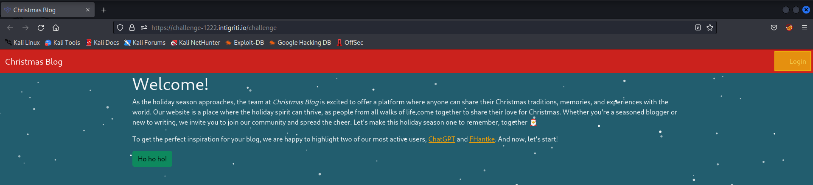

Proof of Concept / description

A Stored Cross-Site Scripting vulnerability exists in the web application. A user can use Base Tag Hijacking in order to redirect relative Javascript imports to a malicious attacker-controlled server. The attacker can host a file containing arbitrary Javascript code.

Firstly, let's create 

