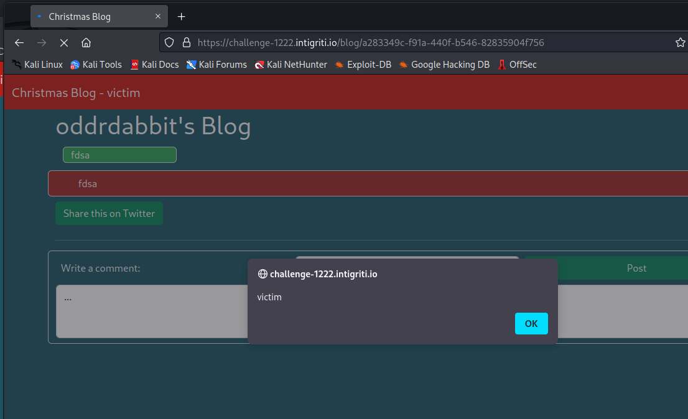

# Proof of Concept / description

## Description

A Stored Cross-Site Scripting vulnerability exists in the web application. A user can use Base Tag Hijacking in order to redirect relative Javascript imports to a malicious attacker-controlled server. The attacker can host a file containing arbitrary Javascript code.

Proof of Concept

Firstly, let's create an account and login.

I will, then, setup a Python Simple HTTP Server in order to host the external Javascript files. I can, then, inject a Base tag and redirect it to my machine in order to achieve Base Tag Hijacking so that it will execute said attacker-controlled Javascript files.

Next, from the source code, it is loading a Bootstrap file. This will be created on the attacker's machine. The payload prints the current logged in user's username.

Once the malicious file is created, I can save the injection.

Which will give pop up an alert.

Logging into another user and browsing to the page proves that one can use this against other users.

